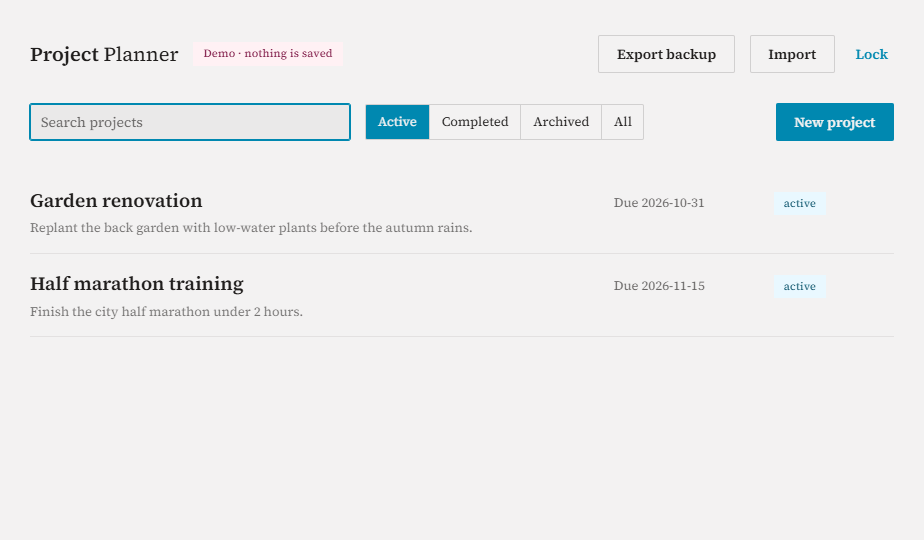
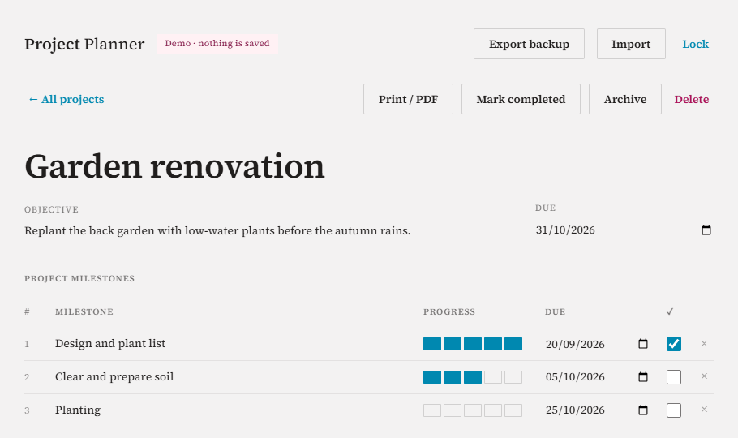
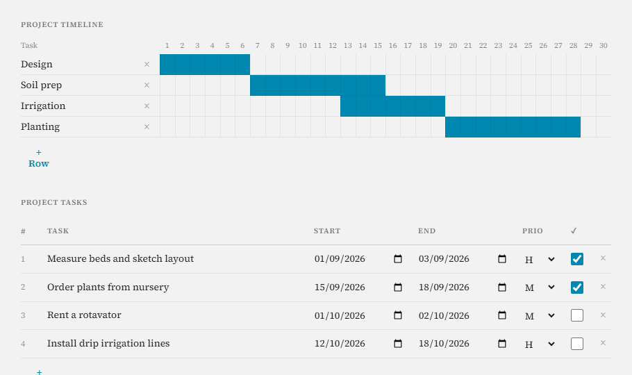
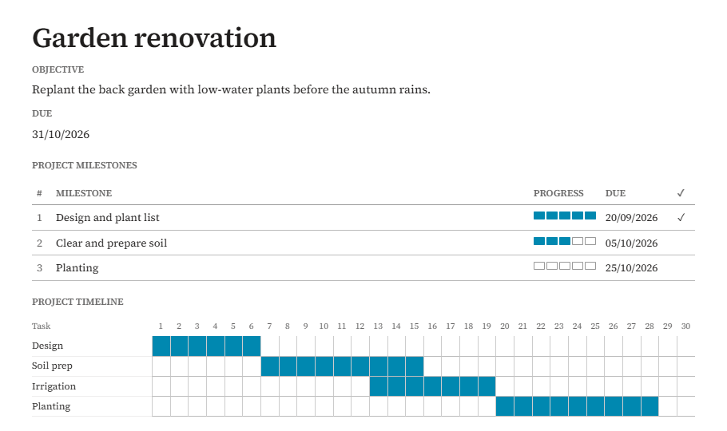

# Project Planner

A private, password-protected project planner that runs entirely in your browser. Create as many projects as you want, each with an objective, milestones, a 30-day timeline, tasks and notes. Print any project or save it as a PDF.

**[Try the demo](https://CristinaRisu.github.io/planner/?demo)** (sample data, nothing is saved)

## Features

- **One sheet per project**: objective and due date, milestones with a 5-step progress bar, a 30-day timeline you fill by clicking days, tasks with start/end dates and priority, free notes.
- **Encrypted with your password**: data is encrypted (AES-256-GCM, key derived with PBKDF2) before it is stored. Without the password nobody can read it, even with access to the code or the files.
- **Search and filter** by active, completed or archived.
- **Print / PDF** a clean version of any project.
- **Backups**: export an encrypted `.json` file and import it on any computer.
- **No server, no account, no tracking.** Two files: `index.html` and `styles.css`.

Printed version:

## Get your own copy

You need a free GitHub account.

1. Click **Fork** (top right of this page), then **Create fork**.
2. In your fork go to **Settings → Pages**.
3. Under *Build and deployment*, choose **Deploy from a branch**, branch **main**, folder **/ (root)**, then **Save**.
4. After 1–2 minutes your planner is live at `https://YOUR-USERNAME.github.io/planner/`.
5. Open it and choose a password. **There is no way to recover it**, so keep it somewhere safe.

You can also download `index.html` and `styles.css` and open `index.html` directly on your computer, without GitHub.

## Where is my data?

Your projects are stored, encrypted, in your browser on that computer (`localStorage`). Nothing is uploaded to GitHub or anywhere else. That means:

- Other people who open your URL only see the password screen, and their browser has no data of yours.
- If you clear your browser data or change computer, your projects are not there. **Use Export backup regularly** and keep the file in a safe place (cloud drive, USB).
- To move to another computer: *Export backup* → open the planner on the new computer → *Restore from backup* → unlock with the same password.

## Updating

Replace `index.html` (and `styles.css` if it changed) in your repository. Your data is not affected. Reload the page with **Ctrl+Shift+R** (Mac: **Cmd+Shift+R**) to skip the browser cache.

## License

MIT. Use it, change it, share it.
